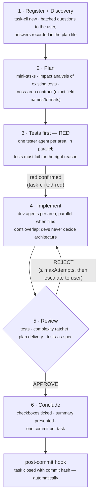
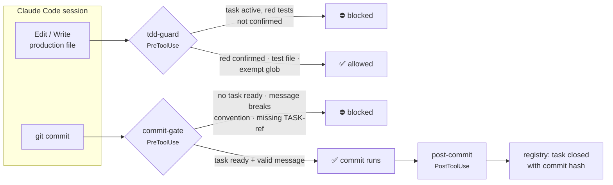
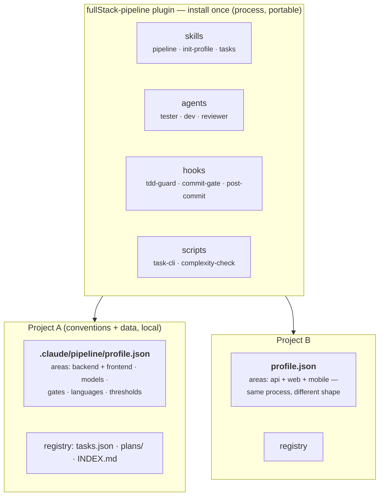

# fullStack-pipeline

A [Claude Code](https://claude.com/claude-code) plugin that packages a complete multi-agent TDD development workflow — discovery, planning, red tests, implementation, adversarial review, and task registry — as a portable unit of **skills + agents + hooks + scripts** that works on any project through a small per-project profile.

It was not designed on a whiteboard. It was extracted from months of daily use building and maintaining a production financial ERP with a team of AI agents, and it encodes the single most important lesson from that experience:

> **Rules written in prompts fail under context pressure. Rules written as code do not.**

Every "non-negotiable" process rule that agents kept skipping when the context grew long — tests before code, every commit registered, review before merge — is enforced here by hooks that **block the action**, not by prose that asks nicely.

And since v0.3 the pipeline **measures itself**: every task records which model matrix ran it, how many rework cycles it took, how long it lasted, and what it cost — so questions like "do cheaper testers actually save money?" are answered by `task-cli report`, not by intuition. See [Telemetry & cost reporting](#telemetry--cost-reporting).

---

## Table of contents

- [How it works](#how-it-works)
- [The enforcement layer](#the-enforcement-layer)
- [Portability: one plugin, many projects](#portability-one-plugin-many-projects)
- [The agents](#the-agents)
- [Task registry](#task-registry)
- [Complexity ratchet](#complexity-ratchet)
- [Customization](#customization)
- [Extending with your own skills](#extending-with-your-own-skills)
- [Telemetry & cost reporting](#telemetry--cost-reporting)
- [Install & quickstart](#install--quickstart)
- [Design decisions](#design-decisions)
- [Layout](#layout)
- [Status & roadmap](#status--roadmap)

---

## How it works

Every task flows through six steps, orchestrated by the `pipeline` skill. The orchestrator (your main session) coordinates and decides architecture *with the user* — on non-trivial tasks it never writes production code itself.



The task's **complexity level (1–5)**, decided with the user up front, picks the orchestration mechanics — this is the main cost lever:

| Level | Meaning | Mechanics |
|---|---|---|
| 1–2 | Small fix, localized change | Plain subagents, fire-and-collect |
| 3–4 | Medium feature, refactor with impact | Named agents per area, message coordination, iterative rework loops |
| 5 | Large feature, architectural change | Named agents + phased execution + incremental review per phase |

The plan produced in step 2 is a **human-readable file** (`.claude/pipeline/plans/TASK-<id>.md`) containing the discovery Q&A, the mini-task checklist, the impact analysis, and — when a task spans areas — the **cross-area contract**: exact field names, value formats, endpoints. The contract lives in a file rather than in agent prompts because files survive context compression and agent respawns; prompts don't. You read and approve the plan *before* execution starts.

## The enforcement layer

Three hooks turn the fragile parts of the process into structural guarantees:



- **`tdd-guard`** — while a pipeline task is in progress and its failing tests have not been confirmed (`task-cli tdd-red`), edits to production source files are rejected. Test files are always allowed; docs/config/migrations can be exempted by glob. A task with genuinely nothing to test requires an explicit, *recorded* reason (`tdd-skip --reason`).
- **`commit-gate`** — `git commit` is rejected unless the active task passed its conclusion checklist (`task-cli ready`). It also validates the commit message: conventional-commits format and a `TASK-<id>` reference, when configured. Unregistered hotfixes stop being a discipline problem — they become structurally rare.
- **`post-commit`** — after a successful commit, the ready task is closed with the commit hash automatically. The "forgot to register the finished task" failure mode is gone by construction.

Both guards support `strict` (block), `advisory` (warn, allow), and `off` modes per project. Escape hatch for genuinely exceptional commits: `PIPELINE_SKIP_GATE=1 git commit ...` — then register retroactively.

Hooks never break a session: on any unexpected condition (missing profile, corrupt state) they allow the action.

## Portability: one plugin, many projects

The architecture splits three layers that usually get tangled together:



The **profile** is the entire per-project contract. Areas are dynamic — one, two, or five (`backend`, `frontend`, `mobile`, `infra`...) — never a hardcoded pair. Each area declares its source globs, test globs, test command, and free-text `notes` injected into agent prompts ("CommonJS only", "TailwindCSS only", ...). A project without a profile is completely untouched by the plugin: everything is opt-in per repository.

## The agents

Three generic personas with strict, deliberately narrow boundaries, instantiated per area at whatever model the profile assigns:

| Agent | Does | Never |
|---|---|---|
| **tester** | Writes failing tests for the planned behavior, runs them, reports red (expected) vs green (suspicious) | Writes production code; decides scope |
| **dev** | Implements until the listed tests pass; adjusts explicitly listed impacted tests; runs the area's test suite before reporting | Decides architecture; edits *other* tests to make them pass; ticks checkboxes |
| **reviewer** | Runs tests + complexity ratchet + plan-delivery + contract checks; reports precise defects | Fixes code; manages the rework loop |

A test that passes *before* implementation proves nothing — testers must flag it. A dev reporting "done" with a red suite is the one unforgivable failure. The reviewer's rework loop is bounded (`rework.maxAttempts`, default 3); before the final attempt the orchestrator checks whether the *test* is wrong, and at the limit it stops and escalates to the user with the failure history.

## Task registry

Local-first, structured, and instant to search — no digging through `git log` to find what a task did:

```
.claude/pipeline/
├── profile.json        the per-project contract
├── tasks.json          structured registry (status, level, tdd state, commit hash, attempts)
├── plans/TASK-7.md     human-readable plan — what you review before authorizing execution
└── INDEX.md            generated overview, newest first (never edited by hand)
```

```bash
node <cliPath> new "Add customer export" --type=improvement --level=3
node <cliPath> search "export"        # titles + full plan contents
node <cliPath> list --status=done
node <cliPath> show 7
node <cliPath> rework 7 --area=backend --reason="contract mismatch"   # review rejection
node <cliPath> report                 # wall time / attempts / cost, grouped per model matrix
```

The lifecycle states double as the hooks' state machine: `planned → in-progress → ready → done`, with the TDD state (`pending → red | skipped+reason`) gating production edits. Whether the registry is git-versioned or local-only is a profile choice.

## Complexity ratchet

The reviewer always runs `scripts/complexity-check.js` on changed files — approximate cyclomatic complexity per function (decision points + 1), dependency-free on purpose: no coupling to the project's linter version, and the same metric measures baseline and current code, which is all a ratchet needs.

**The ratchet rule:** changed code may not exceed the error threshold, and may not be *more complex than it was before the change* (`--baseline=<git-ref>`). Untouched legacy code is out of scope — adopting the plugin never demands a big-bang cleanup; the codebase only gets flatter, one touched function at a time.

```
ERROR backend/src/controllers/OperationsController.js:979 editApproved complexity 17
warn  backend/src/controllers/OperationsController.js:877 edit complexity 15
complexity: 2 file(s), thresholds warn=10 error=15 — 1 violation(s), 1 warning(s).
```

## Customization

Everything is driven by the profile, seeded by the `init-profile` interview from a **preset** and always written fully explicit (a preset only fills defaults — every knob remains individually editable):

| Preset | Intent |
|---|---|
| `strict` | Production code: blocking guards, strongest reviewer at every level, per-task branches, conventional commits |
| `balanced` | The battle-tested default |
| `prototype` | Exploration: advisory guards, cheapest models, no ceremony |

Key knobs:

- **Model matrix** — model per role × level band, the main cost control: `models.reviewer["3-4"] = "opus"` while devs run cheaper; `inherit` uses the session model.
- **`tdd`** — `mode` (strict/advisory/off) + `exempt` globs.
- **`commit`** — gate mode, `format: "conventional"`, `requireTaskRef`, message language.
- **`branch`** — per-task branches (`feat/task-{id}`) from a minimum level.
- **`rework`** — attempt limit before escalating; incremental review on level 5.
- **`language`** — user interaction vs code/comments vs product-facing strings (they often differ; all three are injected into agent prompts).

Full annotated schema in [`skills/init-profile/SKILL.md`](skills/init-profile/SKILL.md).

## Extending with your own skills

**Don't add skills inside the installed plugin** — the install is a cached clone that gets overwritten on every update. Extension happens from the outside, and the boundary is deliberate: the plugin carries the *process*, your project carries the *conventions*.

Two supported paths:

1. **Plain composition.** Skills in your project (`.claude/skills/<name>/SKILL.md`) or user directory (`~/.claude/skills/`) load alongside the plugin's skills in every session — nothing to configure. Good for skills *you* invoke.
2. **Profile-declared skills (the pipeline-aware path).** List skills per area in the profile and the pipeline's *agents* follow them:

   ```json
   "areas": {
     "backend": { "skills": ["backend-rules", "security-checklist"], ... }
   }
   ```

   Testers and devs load the declared skills before writing anything; the reviewer treats violations of a declared skill as a rejection. If a skill can't be resolved at spawn time, the orchestrator inlines its `SKILL.md` content into the agent prompt — a declared skill is never silently dropped. This is where code-rules skills, security checklists, and domain conventions belong.

Teams that want skills *inside* the plugin's namespace can fork the repo (it's its own marketplace) and install from the fork — at the cost of rebasing on updates. For almost every case, path 2 is the better answer.

## Telemetry & cost reporting

The registry doubles as a process-metrics store, so "does the model matrix actually save money?" is answered with data instead of intuition:

- `task-cli start` snapshots which matrix cells (model + effort per role) applied to the task.
- Every review rejection is recorded (`task-cli rework`) — attempts feed both the rework limit and the report.
- Wall time comes from the `start`/`done` timestamps; the commit hash links cost to code.
- Token usage per model can be attached (`task-cli usage --json=...`); the report prices it with a built-in per-Mtok table (overridable via `profile.prices`).
- `task-cli report` prints per-task wall time / attempts / estimated cost, **aggregated per matrix signature** — run the same tasks under two matrices (e.g. all-opus vs tiered) from the same base commit and the report is your A/B comparison.

For exact token counts per model, enable Claude Code's OpenTelemetry metrics export (see the official docs on monitoring — token usage is emitted per model) and feed the totals into `task-cli usage`. Without OTel the report still gives wall time, attempts, and matrix comparisons; cost columns just stay empty.

The economics being measured: dropping mechanical roles a tier (tester on Haiku, devs on Sonnet, reviewer kept strong) cuts a typical multi-agent task's token cost by roughly 40% — **but one full rework cycle caused by a weaker dev eats most of that saving**. The report exists to find each project's break-even.

## Install & quickstart

```bash
# local (development)
claude --plugin-dir /path/to/fullStack-pipeline
```

From GitHub (the repo hosts its own marketplace):

```shell
/plugin marketplace add felipeJJ/fullStack-pipeline
/plugin install fullStack-pipeline@fullStack-pipeline
/reload-plugins
```

Inside a project:

1. Run the **`init-profile`** skill once — it inspects the repo (areas, test scripts, lint setup), interviews you for the rest, writes the profile, and baselines the complexity distribution.
2. Start any task with the **`pipeline`** skill and describe what you want.
3. Look things up anytime with the **`tasks`** skill ("what's open?", "find the task that touched exports").

## Design decisions

**Why hooks instead of better prompts?** Because we watched better prompts fail. The origin project had ALL-CAPS "NON-NEGOTIABLE" rules in its workflow docs; under long contexts agents still skipped the conclusion checklist, edited code before tests, and forgot hotfix registration. Every one of those failures is now a blocked tool call. Judgment stays in prompts; discipline moves into code.

**Why "tests are the spec"?** The origin project maintained a canonical behavior spec (SSOT) — powerful, but expensive to keep in sync. The portable replacement: if a change breaks an existing test, the agent must stop and ask whether it's an intentional behavior change (update test + code together) or a regression (fix the code). Silently "fixing" a test is never an option, and an edited test without a recorded user decision is a review rejection. Same protection, zero standing documentation cost.

**Why a local-first registry instead of GitHub Issues or git log?** Speed and reviewability. Plans are files you read *before* execution; search is instant and offline; nothing about your task history leaves the repo unless you version it. Commit hashes still link every task to its code.

**Why approximate complexity instead of ESLint's rule?** Zero coupling to each project's linter major version and config format. A ratchet compares a number against the same number computed the same way at the baseline — internal consistency is what matters, not agreement with any specific tool.

**Why dynamic areas?** The origin workflow hardcoded a backend/frontend pair — the single biggest obstacle to reuse. Areas are now data, so a CLI tool, a monorepo with five packages, or an api+web+mobile product all get the same process with a different profile.

## Layout

```
.claude-plugin/plugin.json           manifest
skills/
├── pipeline/SKILL.md                the orchestrator (6 steps)
│   └── references/
│       ├── orchestration.md         agent mechanics: naming, parallelism, workflows
│       └── reviewer-protocol.md     review gates, rework loop, rollback options
├── init-profile/SKILL.md            per-project setup interview (+ full profile schema)
└── tasks/SKILL.md                   registry usage
agents/
├── tester.md · dev.md · reviewer.md generic personas, parameterized by area
hooks/hooks.json                     tdd-guard · commit-gate · post-commit
scripts/
├── task-cli.js                      local registry CLI
├── complexity-check.js              dependency-free complexity ratchet
└── hooks/                           hook implementations (+ shared lib)
```

## Status & roadmap

- **v0.1** — extracted architecture: skills, agents, hooks, registry, ratchet.
- **v0.2** — customization layer: presets, model matrix, gate modes, branch/commit/language policies.
- **v0.3** — telemetry: matrix snapshots, rework/attempt tracking, usage-based cost estimation, `report` with per-matrix A/B aggregation; matrix cells accept per-role effort.
- **v0.4** — extensibility: per-area `skills` in the profile; pipeline agents load declared project/user skills (Skill tool) and the reviewer enforces them.
- **Next** — field validation: real level-3 tasks on live projects, tightening the skill wording against observed failures; a second project with a different area shape; marketplace listing.

## License

[MIT](LICENSE)
